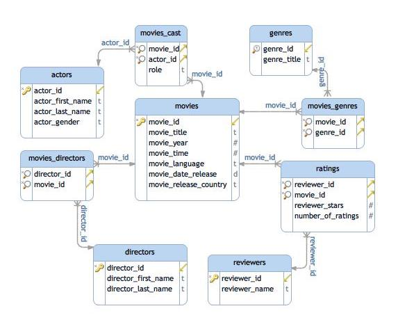

# Database: dvdrental
CAVEAT: The table staff is corrupted, it runs fine in pgAdmin but fails in jupyter notebook. It has 2 good rows 
and third row has one dot.

## schema


## Files:
```
├── dvdrental
│   ├── 2163.dat
│   ├── 2165.dat
│   ├── 2167.dat
│   ├── 2168.dat
│   ├── 2169.dat
│   ├── 2171.dat
│   ├── 2173.dat
│   ├── 2175.dat
│   ├── 2177.dat
│   ├── 2179.dat
│   ├── 2181.dat
│   ├── 2183.dat
│   ├── 2185.dat
│   ├── 2187.dat
│   ├── 2189.dat
│   ├── restore.sql
│   └── toc.dat
```

## First two lines of each files
```bash
for f in `ls ../data/dvdrental/[^toc]*.dat`                                                                
   do
      echo
      echo  "File: $f"; 
      echo "==================================================================="
      head -2  "$f";
done;
```

```
File: ../data/dvdrental/2185.dat
===================================================================
2	2005-05-24 22:54:33	1525	459	2005-05-28 19:40:33	1	2006-02-16 02:30:53
3	2005-05-24 23:03:39	1711	408	2005-06-01 22:12:39	1	2006-02-16 02:30:53

File: ../data/dvdrental/2183.dat
===================================================================
17503	341	2	1520	7.99	2007-02-15 22:25:46.996577
17504	341	1	1778	1.99	2007-02-16 17:23:14.996577

File: ../data/dvdrental/2167.dat
===================================================================
133	Chamber Italian	A Fateful Reflection of a Moose And a Husband who must Overcome a Monkey in Nigeria	2006	1	7	4.99	117	14.99	NC-17	2013-05-26 14:50:58.951	{Trailers}	'chamber':1 'fate':4 'husband':11 'italian':2 'monkey':16 'moos':8 'must':13 'nigeria':18 'overcom':14 'reflect':5
384	Grosse Wonderful	A Epic Drama of a Cat And a Explorer who must Redeem a Moose in Australia	2006	1	5	4.99	49	19.99	R	2013-05-26 14:50:58.951	{"Behind the Scenes"}	'australia':18 'cat':8 'drama':5 'epic':4 'explor':11 'gross':1 'moos':16 'must':13 'redeem':14 'wonder':2

File: ../data/dvdrental/2168.dat
===================================================================
1	1	2006-02-15 10:05:03
1	23	2006-02-15 10:05:03

File: ../data/dvdrental/2179.dat
===================================================================
1	1	1	2006-02-15 10:09:17
2	1	1	2006-02-15 10:09:17

File: ../data/dvdrental/2177.dat
===================================================================
524	1	Jared	Ely	jared.ely@sakilacustomer.org	530	t	2006-02-14	2013-05-26 14:49:45.738	1
1	1	Mary	Smith	mary.smith@sakilacustomer.org	5	t	2006-02-14	2013-05-26 14:49:45.738	1

File: ../data/dvdrental/2171.dat
===================================================================
1	47 MySakila Drive	\N	Alberta	300			2006-02-15 09:45:30
2	28 MySQL Boulevard	\N	QLD	576			2006-02-15 09:45:30

File: ../data/dvdrental/2169.dat
===================================================================
1	6	2006-02-15 10:07:09
2	11	2006-02-15 10:07:09

File: ../data/dvdrental/2173.dat
===================================================================
1	A Corua (La Corua)	87	2006-02-15 09:45:25
2	Abha	82	2006-02-15 09:45:25

File: ../data/dvdrental/2163.dat
===================================================================
1	Penelope	Guiness	2013-05-26 14:47:57.62
2	Nick	Wahlberg	2013-05-26 14:47:57.62

File: ../data/dvdrental/2175.dat
===================================================================
1	Afghanistan	2006-02-15 09:44:00
2	Algeria	2006-02-15 09:44:00

File: ../data/dvdrental/2165.dat
===================================================================
1	Action	2006-02-15 09:46:27
2	Animation	2006-02-15 09:46:27

File: ../data/dvdrental/2187.dat
===================================================================
1	Mike	Hillyer	3	Mike.Hillyer@sakilastaff.com	1	t	Mike	8cb2237d0679ca88db6464eac60da96345513964	2006-05-16 16:13:11.79328	\\x89504e470d0a5a0a
2	Jon	Stephens	4	Jon.Stephens@sakilastaff.com	2	t	Jon	8cb2237d0679ca88db6464eac60da96345513964	2006-05-16 16:13:11.79328	\N

File: ../data/dvdrental/2181.dat
===================================================================
1	English             	2006-02-15 10:02:19
2	Italian             	2006-02-15 10:02:19

File: ../data/dvdrental/2189.dat
===================================================================
1	1	1	2006-02-15 09:57:12
2	2	2	2006-02-15 09:57:12
```
